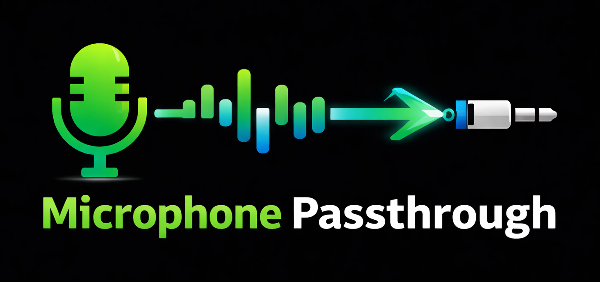

# Microphone Passthrough

[](https://github.com/mikejhill/mic-passthrough/actions/workflows/ci.yml)
[](https://github.com/mikejhill/mic-passthrough/actions/workflows/release.yml)



A low-latency audio passthrough application that routes a microphone's audio to [VB-Audio Virtual Cable](https://vb-audio.com/Cable/) using Windows WASAPI audio APIs.

> [!NOTE]
> **AI-Generated Code Disclaimer**: AI was heavily used in the creation of this project. While the sources have been reviewed and tested, users are strongly advised to review and understand the code themselves before using this project.

## Purpose

This tool solves the **Phone Link microphone volume bug** for USB microphones. When using Phone Link with a USB microphone, Windows incorrectly applies gain to the audio signal, resulting in extremely quiet or distorted microphone input even when volume is set to maximum.

**The Solution**: By routing your USB microphone through VB-Audio Virtual Cable (which properly handles audio gain), Phone Link receives clear, full-volume audio from your physical microphone.

### General Uses
Beyond Phone Link, this tool enables seamless microphone audio routing with minimal latency (~100ms), useful for:
- Streaming applications requiring virtual microphone input
- Real-time audio processing pipelines
- Testing audio-based applications
- Creating virtual microphone outputs from physical devices

### Related Issue
See [Microsoft Answers: Microphone volume in Phone Link has gone (almost) quiet](https://learn.microsoft.com/en-nz/answers/questions/5551238/microphone-volume-in-phone-link-has-gone-%28almost%29) for more context on this bug.

## Requirements

### System Requirements
- **Windows 10/11** - Uses WASAPI (Windows Audio Session API)
- **.NET SDK 10.0** or later
- **VB-Audio Virtual Cable** - Free download from [vb-audio.com](https://vb-audio.com/Cable/)

### Installation

#### Install .NET 10 SDK

1. **Download** the .NET 10 SDK from [dotnet.microsoft.com](https://dotnet.microsoft.com/download/dotnet/10.0)
2. **Install** the x64 or x86 installer (x64 recommended for most systems)
3. **Verify** installation:
   ```powershell
   dotnet --version
   ```
   Should output `10.0.x` or higher

#### Install VB-Audio Virtual Cable

1. **Download** from [vb-audio.com/Cable/](https://vb-audio.com/Cable/)
2. **Install** the driver (requires admin rights and system restart)
3. **Restart** your computer to activate the virtual cable
4. **Verify** by checking Windows Sound Settings - you should see:
   - "CABLE Input (VB-Audio Virtual Cable)" in playback devices
   - "CABLE Output (VB-Audio Virtual Cable)" in recording devices

#### Configure VB-Audio Virtual Cable

After installation, configure the cable properly for Phone Link:

1. **Enable Windows Volume Control**:
   - Open `VBCABLE_ControlPanel.exe` from the installation folder
   - In VB-Audio Cable settings, go to **Options**
   - Enable **"Windows Volume Control"** (this allows proper volume control in Phone Link)

2. **Set CABLE Output as Default Microphone**:
   - In Windows Sound Settings, navigate to **Input**
   - Click **"CABLE Output (VB-Audio Virtual Cable)"**
   - This tells Phone Link and other applications to use CABLE Output as the microphone input
   - Under **Output**, ensure your _usual speaker device_ is selected as the default playback device, **not** CABLE Input

3. **Verify Setup**:
   - MicPassthrough will route your physical USB mic → CABLE Input
   - Phone Link will listen to CABLE Output (which receives the audio)
   - Your microphone audio now bypasses the buggy Windows gain handling

## Building

### First Build

```powershell
# Navigate to project directory
cd MicPassthrough

# Restore dependencies and build
dotnet build
```

This creates the executable at: `src/MicPassthrough/bin/Debug/net10.0/MicPassthrough.exe`

### Subsequent Runs

Run the compiled executable directly:
```powershell
.\src\MicPassthrough\bin\Debug\net10.0\MicPassthrough.exe --help
```

Quick tests can be done without a full rebuild:
```powershell
cd src\MicPassthrough
dotnet run -- --help
```

### Clean Rebuild

When modifying source code:
```powershell
dotnet clean && dotnet build
```

## Usage

### Basic Usage

List available audio devices:
```powershell
.\src\MicPassthrough\bin\Debug\net10.0\MicPassthrough.exe --list-devices
```

Route microphone to virtual cable:
```powershell
.\src\MicPassthrough\bin\Debug\net10.0\MicPassthrough.exe --mic "Microphone (HD Pro Webcam C920)" --cable-render "CABLE Input (VB-Audio Virtual Cable)"
```

> **Note**: Replace the path with your actual .exe location if using a different build configuration (e.g., Release build)

### Command-Line Options

```
-m, --mic <device-name>
    Microphone device name (exact match). Use --list-devices to see available names.
    [REQUIRED unless using --list-devices]

-c, --cable-render <device-name>
    VB-Cable render device name for audio passthrough output (exact match).
    This is the VB-Audio Virtual Cable INPUT device (playback/speaker side).
    [default: CABLE Input (VB-Audio Virtual Cable)]

--cable-capture <device-name>
    VB-Cable capture device name for setting as default microphone (exact match).
    This is the VB-Audio Virtual Cable OUTPUT device (recording/microphone side).
    Only used with --auto-switch mode.
    [default: CABLE Output (VB-Audio Virtual Cable)]

-o, --monitor <device-name>
    Monitor output device name (exact match). Only used with --enable-monitor.

-e, --enable-monitor
    Enable real-time audio monitoring through speakers/headphones.
    Use when you want to hear the passthrough audio directly.

-b, --buffer <milliseconds>
    Buffer size in milliseconds. Controls latency vs. stability trade-off.
    - Larger values (150-200ms) = more stable but higher latency
    - Smaller values (50-75ms) = lower latency but risk of audio glitches
    [default: 100]

-x, --exclusive-mode <true|false>
    Attempt exclusive audio mode for lower latency (~10ms).
    Exclusive mode gives direct hardware access but may fail if device is in use.
    Use '--exclusive-mode false' to force shared mode if you get errors.
    [default: true]

-p, --prebuffer-frames <count>
    Number of audio frames to buffer before starting playback.
    Prevents initial stuttering and clicks.
    - Increase (4-5) if you hear clicks at startup
    - Decrease (1-2) for faster startup
    [default: 3]

-l, --list-devices
    List all available audio devices and exit.

-v, --verbose
    Enable detailed logging with timestamps showing device initialization,
    buffer status, and statistics every 100 frames.

-a, --auto-switch
    Enable automatic passthrough control and default microphone switching.
    When enabled, MicPassthrough will:
    - Monitor when PhoneLink (or other apps) start using your microphone
    - Automatically start audio passthrough
    - Automatically switch Windows default microphone to CABLE Output
    - Stop passthrough and restore original microphone when the call ends
    This prevents other applications from being affected when you're not on a call.
    Requires administrator privileges for microphone switching.
    [default: false]

--help
    Display help screen.

--version
    Display version information.
```

### Examples

**Basic passthrough (default cable output) - Phone Link setup:**
```powershell
.\src\MicPassthrough\bin\Debug\net10.0\MicPassthrough.exe --mic "Microphone (HD Pro Webcam C920)"
```
Then open Phone Link - it will use CABLE Output (your routed microphone) and audio will be clear and full volume.

**Automatic smart mode (Phone Link only, runs in background):**
```powershell
.\src\MicPassthrough\bin\Debug\net10.0\MicPassthrough.exe --mic "Microphone (HD Pro Webcam C920)" --auto-switch
```
MicPassthrough will:
1. Sit idle in the background until you start a Phone Link call
2. Automatically detect the call and activate passthrough
3. Automatically switch Windows default microphone to CABLE Output
4. Monitor until the call ends, then stop passthrough and restore your microphone
5. Return to idle, not affecting any other applications

This is the recommended mode for minimal interference with your other applications.
> **Note**: Requires administrator privileges (UAC prompt on Windows 10/11)**With monitoring enabled (hear yourself in speakers):**
```powershell
.\src\MicPassthrough\bin\Debug\net10.0\MicPassthrough.exe --mic "Microphone (HD Pro Webcam C920)" --enable-monitor --monitor "Speakers (Realtek(R) Audio)"
```

**Lower latency, higher CPU load:**
```powershell
.\src\MicPassthrough\bin\Debug\net10.0\MicPassthrough.exe --mic "Microphone (HD Pro Webcam C920)" --buffer 50
```

**Stable high-quality, more latency:**
```powershell
.\src\MicPassthrough\bin\Debug\net10.0\MicPassthrough.exe --mic "Microphone (HD Pro Webcam C920)" --buffer 200
```

**Disable exclusive mode if device busy:**
```powershell
.\src\MicPassthrough\bin\Debug\net10.0\MicPassthrough.exe --mic "Microphone (HD Pro Webcam C920)" --exclusive-mode false
```

**Verbose output with real-time statistics:**
```powershell
.\src\MicPassthrough\bin\Debug\net10.0\MicPassthrough.exe --mic "Microphone (HD Pro Webcam C920)" --verbose
```

## Daemon Mode (Professional Background Operation)

For a professional experience without a console window, use daemon mode with system tray integration:

```powershell
MicPassthrough.exe --mic "Microphone (HD Pro Webcam C920)" --daemon
```

Features:
- 🎯 System tray icon with real-time status display
- 🖱️ Double-click to toggle passthrough on/off
- ⚙️ Right-click menu for Start/Stop/Exit controls  
- 🔔 Status notifications for all user actions
- 🎨 Professional application icon in tray

For detailed daemon mode usage, architecture, and advanced options, see [Daemon Mode Documentation](docs/DAEMON_MODE.md).

## Testing

After setting up the passthrough, verify that audio is being routed correctly using one of these methods:

**Option 1: Windows Sound Recorder**

1. Open the built-in "Sound Recorder" app in Windows
2. Click "Start recording"
3. Speak into your microphone
4. Click "Stop recording"
5. Playback the recording - you should hear your voice clearly at full volume
6. If audio is quiet or distorted, check your VB-Audio Cable configuration (especially Windows Volume Control setting)

**Option 2: Echo Service (Test Number)**

Call an automated echo service to hear your own voice echoed back:
- **US**: +1-909-390-0003 or +1-804-222-1111
- The service will echo your voice back to you
- You should hear clear, full-volume audio
- If audio is quiet, the Phone Link bug is still affecting you; verify CABLE Output is set as default microphone

**Option 3: Real Call (Recommended)**

Call someone you know to test with a real person:
1. Start MicPassthrough with your USB microphone
2. Make a call via Phone Link or your calling application
3. Ask the other person: "Can you hear me clearly at normal volume?"
4. Listen for feedback - they should NOT report you as quiet or distorted
5. This is the real-world test that confirms the fix is working

### Success Criteria
- Audio is clear and at normal volume (not quiet or distorted)
- No clicking or stuttering sounds
- Latency is unnoticeable (~100ms is imperceptible in real-time conversation)
- Consistent audio throughout the call/recording

## Audio Configuration

### Buffer Behavior

The buffer indicates how much audio is currently queued:
- **Reading**: "buffer: 75ms" means 75ms of audio waiting to be played
- **Healthy**: 60-90ms (good balance between latency and stability)
- **Too high** (approaching 100ms): Input faster than output, consider larger buffer or reducing source quality
- **Too low** (near 0ms): Risk of audio dropouts, increase buffer size or prebuffer frames

Typical output:
```
[21:19:34.098] dbug: Program[0] Stats: 100 frames, 1,607,680 bytes, 6.3s processed, buffer: 69.4ms
```

### Latency

Expected latency breakdown:
- **WASAPI internal**: ~30ms (OS-managed microphone buffer)
- **Application buffer**: ~100ms (configurable)
- **Total**: ~100-110ms (unnoticeable for most use cases)

To reduce latency:
1. Try `--buffer 50` or `--buffer 75` 
2. Ensure `--exclusive-mode true` is active (not forced to shared mode)
3. Monitor system resource usage - CPU contention increases latency
4. Check for other audio applications running simultaneously

### Troubleshooting

**"Device not found" error:**
- Use `--list-devices` to see exact device names
- Device names must match exactly (case-sensitive)
- Copy-paste device names from list to avoid typos

**No audio output:**
- Verify microphone is not muted in Windows Sound Settings
- Check VB-Audio Virtual Cable is installed and visible in Sound Settings
- Ensure other applications aren't using exclusive audio mode on the cable

**Audio glitches/stuttering:**
- Increase buffer size: `--buffer 150`
- Increase prebuffer frames: `--prebuffer-frames 4`
- Check CPU usage - resource contention causes audio glitches
- Close unnecessary applications

**Exclusive mode failures:**
- Other audio applications using the device
- Solution: Use `--exclusive-mode false`
- Trade-off: Slightly higher latency but better compatibility

**High latency:**
- Decrease buffer size: `--buffer 50`
- Verify `--exclusive-mode true` is active (check verbose logs)
- Check system load and CPU usage

## Architecture

### Components

- **src/MicPassthrough/Program.cs** - Entry point, initializes logging and application framework
- **src/MicPassthrough/Options.cs** - Command-line option definitions with validation
- **src/MicPassthrough/PassthroughApplication.cs** - Main orchestrator, handles application lifecycle
- **src/MicPassthrough/AudioDeviceManager.cs** - Audio device enumeration and discovery
- **src/MicPassthrough/PassthroughEngine.cs** - Core audio processing, WASAPI integration

### Audio Flow

```
Microphone Device
    ↓ (WASAPI Capture)
AudioClient (Windows)
    ↓ (DataAvailable events)
PassthroughEngine
    ↓ (Frame buffering)
BufferedWaveProvider (100ms)
    ↓ (WASAPI Render)
VB-Audio Cable / Monitor Speaker
```

## Building for Release Distribution

To create a self-contained executable that doesn't require .NET SDK:

```powershell
dotnet publish -c Release -r win-x64 -p:PublishSingleFile=true -p:SelfContained=true
```

Output executable: `src/MicPassthrough/bin/Release/net10.0/win-x64/publish/MicPassthrough.exe`

This can be shared with others who don't have .NET installed. Simply run:
```powershell
MicPassthrough.exe --mic "Your Microphone Name"
```

## License

This project is licensed under the **MIT License** - see the [LICENSE](LICENSE) file for details.

### Dependencies

This project uses the following open-source libraries (all MIT licensed):
- **NAudio** - Audio I/O library ([github.com/naudio/NAudio](https://github.com/naudio/NAudio))
- **CommandLineParser** - CLI argument parsing ([github.com/commandlineparser/commandline](https://github.com/commandlineparser/commandline))
- **Microsoft.Extensions.Logging** - Logging framework ([github.com/dotnet/runtime](https://github.com/dotnet/runtime))

## See Also

- [VB-Audio Virtual Cable](https://vb-audio.com/Cable/)
- [NAudio Library](https://github.com/naudio/NAudio)
- [CommandLineParser](https://github.com/commandlineparser/commandline)
- [Windows WASAPI Documentation](https://docs.microsoft.com/en-us/windows/win32/coreaudio/wasapi)
